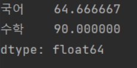
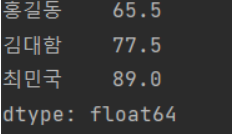

# Pandas Apply()

Pandas DataFrame 타입의 객체에서 호출할 수 있는 함수 이다.

추가로 Series 타입의 객체도 apply를 사용할 수 있고, map 함수 도 사용할 수 있다

행 또는 열 또는 전체 셀에 원하는 연산을 지원한다.

행은 사라지고 열단위로 집계하고 싶은 경우 axis = 0 를 지정하고, 열은 사라지고 행 단위로 집계하고 싶은 경우 axis = 1으로 지정한다.


#### 실습

단일함수를 호출하는 경우, axis =0,1의 결과값이 같다

```python
import numpy as np
import pandas as pd
import math

df = pd.DataFrame({'국어' : [51,65,78], 
                  '수학' : [80,90,100]},
                  index = ['홍길동','김대한','최민국'])
```

 여기서 

```python
df.apply(np.sqrt, axis = 0)
```

> sqrt 제곱근 구하기


집계함수 average와 같은 함수를 호출하는 경우

```python
df.apply(np.average, axis = 0)
```



```python
df.apply(np.average, axis = 1)
```




여기서 axis = 1은 행 단위로 집계하므로 각 인덱스에 적용 가능하다.

따라서 데이터 프레임의 새로운 열에 대입할 수 있다

```python
df['평균'] = df.apply(~~~,axis = 1)
```

