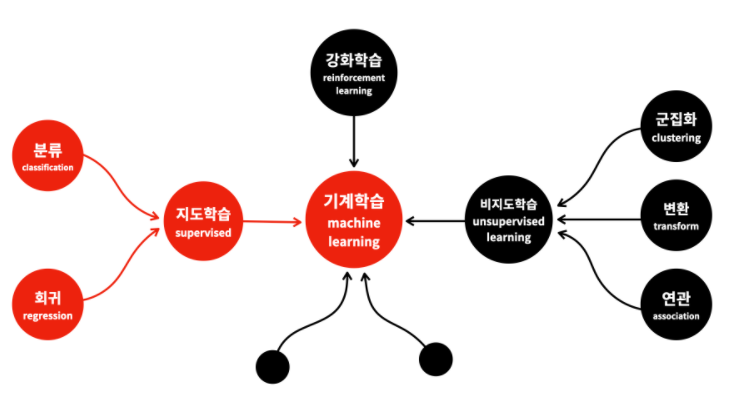
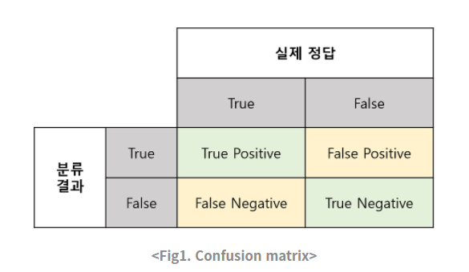

# 분류모델 (Classification) 




##  분류성능평가지표



- True Positive(TP) : 실제 True인 정답을 True라고 예측
- False Positive(FP) : 실제 False인 정답을 True라고 예측
- False Negative(FN) : 실제 True인 정답을 False라고 예측
- True Negative(TN) : 실제 False인 정답을 False라고 예측

1종 오류(FP), 2종 오류(FN)의 개념이 등장한다. 이 두 유형의 오류는 분류 과제의 성격에 따라 경중이 다르다.

예를 들어 중고차 성능 판별 과제에서는 1종 오류(False Positive), 즉 좋은 자동차라 예측하고 구매하였지만 실제로는 좋지 않은 자동차였을 경우가 더 치명적이다. 좋은 중고차를 나쁜 차로 예측해서 구매하지 않더라도 손해볼 것이 없지만 나쁜 중고차를 좋은 차로 잘못 예측하여 구매하는 건 굉장한 손해니까.

그러나 분류 과제가 암환자 진단이라면 2종 오류(True Negative), 즉 암 환자를 건강하다고 판별하는 경우가 훨씬 치명적이다. 그 사람의 생명이 위험해질 수 있으니까.

 이 개념을 파이썬 코드로 표현해보면

```python
labels = [1, 0, 0, 1, 1, 1, 0, 1, 1, 1]
guesses = [0, 1, 1, 1, 1, 0, 1, 0, 1, 0]
for i in range(len(guesses)):
  #True Positives
  if labels[i] == 1 and guesses[i] == 1:
    true_positives += 1
  #True Negatives
  if labels[i] == 0 and guesses[i] == 0:
    true_negatives += 1
  #False Positives
  if labels[i] == 0 and guesses[i] == 1:
    false_positives += 1
  #False Negatives
  if labels[i] == 1 and guesses[i] == 0:
    false_negatives += 1
```


### 1. Precision, Recall and Accuracy

#### 1.1 Precision(정밀도)

**정밀도**란 모델이 True라고 분류한 것 중에서 실제 True인 것의 비율입니다. 즉, 아래와 같은 식으로 표현할 수 있습니다.


**Positive 정답률**, **PPV(Positive Predictive Value)**라고도 불립니다. 날씨 예측 모델이 맑다로 예측했는데, 실제 날씨가 맑았는지를 살펴보는 지표라고 할 수 있겠습니다.


#### Precision의 단점

결국 precision을 사용할 때의 단점은 곧 recall을 사용할 때의 장점이 되기도 한다.**recall과 precision은 서로 반대 개념의 지표**이기 때문이다. 하나가 내려가면 다른 하나는 올라갈 수밖에 없다.

그래서 알고리즘을 평가할 때 recall과 precision 모두 나름대로 유용한 지표이긴 하지만, 그 알고리즘의 성능을 충분히, 효과적으로 표현하기에는 한계가 있다. 그래서 생겨난 게 **recall과 precision의 조화평균, F1 Score**다.


#### 1.2 Recall(재현율)

**재현율**이란 실제 True인 것 중에서 모델이 True라고 예측한 것의 비율입니다. 


예로 들었던 시간당 1m 이상의 눈이 내릴지 예측하는 과제에 적절한 거다. 그러면 실제로 그렇게 눈이 내린 날짜 중 몇 개나 맞히는지 확인할 수 있으니까. 만약 여기서 언제나 False로 예측하는 분류기가 있다면 accuracy는 거의 99%를 넘기겠지만, True Positive를 찾을 수 없으니 recall이 0이 된다.


리콜 모델은 대부분 양품, 불량품을 찾을 때, 데이터 셋이 언밸런싱 할 때 많이 사용한다.


#### <Recall의 단점>

그러나 안타깝게도 recall 또한 완벽한 통계 지표가 아니다. 시간당 적설량 1m 이상이 될지 분류하는 과제에서 언제나 True만 답하는 분류기가 있다고 해보자. 그러면 accuracy는 낮지만 눈이 많이 온 날에 대해서만큼은 정확하게 맞힐 수 있기 때문에 recall은 1이 된다. 이 역시 말이 안 되는 지표다.

그리고 이럴 때 해당 알고리즘에 결함이 있음을 잘 나타내는 지표는 바로 precision이다.


#### 1.3 Accuracy(정확도)

이제는 또 관점을 다르게 생각해봅시다. 사고의 확장이 빠른 사람들은 예상했겠지만, 위 두 지표는 모두 True를 True라고 옳게 예측한 경우에 대해서만 다루었습니다. 하지만, False를 False라고 예측한 경우도 옳은 경우입니다. 이때, 해당 경우를 고려하는 지표가 바로 **정확도(Accuracy)**입니다. 식으로는 다음과 같이 나타냅니다.


정확도는 가장 직관적으로 모델의 성능을 나타낼 수 있는 평가 지표입니다. 하지만, 여기서 고려해야하는 것이 있습니다. 바로 domain의 편중(bias)입니다. 만약 우리가 예측하고자 하는 한달 동안이 특정 기후에 부합하여 비오는 날이 흔치 않다고 생각해보죠. 이 경우에는 해당 data의 domain이 불균형하게되므로 맑은 것을 예측하는 성능은 높지만, 비가 오는 것을 예측하는 성능은 매우 낮을 수 밖에 없습니다. 따라서 이를 보완할 지표가 필요합니다.

#### Accuracy의 단점

예를 들어 내일 서울에 시간당 1m 이상의 눈이 내릴지 여부를 예측한다고 해보자. 그땐 뭐 머신러닝이고 뭐고 할 거 없이 나 혼자서도 매우 정확한 분류기를 만들 수 있다. 그냥 무조건 Negative를 예측하면 이 분류기는 99.9% 정도의 accuracy를 나타낼 거다. 그 정도 눈 내리는 날은 거의 없으니까. 이 분류기는 정답을 True Negative로만 잔뜩 맞히는 셈이다. True Positive는 하나도 발견하지 못하고.

이런 상황을 **정확도 역설(Accuracy Paradox)**라고 부른다.

그래서 이렇게 **실제 데이터에 Negative 비율이 너무 높아서** 희박한 가능성으로 발생할 상황에 대해 제대로 된 분류를 해주는지 평가해줄 지표는 바로 recall(재현율)이다.


### 1.4 F1 score

F1 score는 Precision과 Recall의 조화평균 


F1 score는 데이터 label이 불균형 구조일 때, 모델의 성능을 정확하게 평가할 수 있으며, 성능을 하나의 숫자로 표현할 수 있다