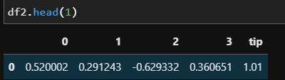

# **PCA**

## **PCA는 무엇이며 언제 사용하는가?**

PCA는 단순히 주성분 분석이라기보다는 주성분이 될 수 있는 형태로 내가 가지고 있는 기존 데이터에 어떤 변환을 가하는 것이다. 

결론적으로 내가 가지고 있는 데이터에 어떤 기준에 의해서 어떤 변환이 생기게 되고 그 변환으로 인해 '주성분'이 추출된다.

그러므로, 이 주성분은 내가 원래 가지고 있는 데이터와 다르다. 변환된 데이터이다. 

**따라서, 원래 변수가 가지고 있는 의미 즉 열의 의미가 중요한 경우에는 PCA를 사용하면 안 된다.** 


## **그렇다면, 언제 PCA를 사용해야 하는가?** 


PCA의 본질은 **탐색적 분석**이다. 즉, 변인을 탐색해서 변환을 통해 주성분을 결정하는 방법이다. 


**결론적으로 PCA의 본질은 차원 축소이다.** 

**차원이 축소됐다는 것은 원본 데이터가 아니라** 

**변환(projection) 된 데이터 == 주성분을 이용해** 

**분석 혹은 모델링을 진행하겠다는 것이다.** 


## PCA 모델링

```python
from sklearn.decomposition import PCA
```

먼저 pca를 하기 전에 분산값을 이용하여 차원 축소를 하는 것이기 때문에 표준화나 정규화를 하는 것이 좋다.

```python
# 표준화
from sklearn.preprocessing import StandardScaler
df_norm = StandardScaler().fit_transform(df1)
# df1은 tip.csv
df_norm = pd.DataFrame(df_norm)

trans = PCA(n_components=4)
# 4개로 축소
X_dim = trans.fit_transform(df_norm)

df2 = pd.DataFrame(X_dim)

df2['tip'] = y
```



 == >  기존 데이터를 합쳐서? 새로운 피처를 만들어서 타켓변수를 설명

