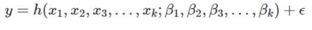
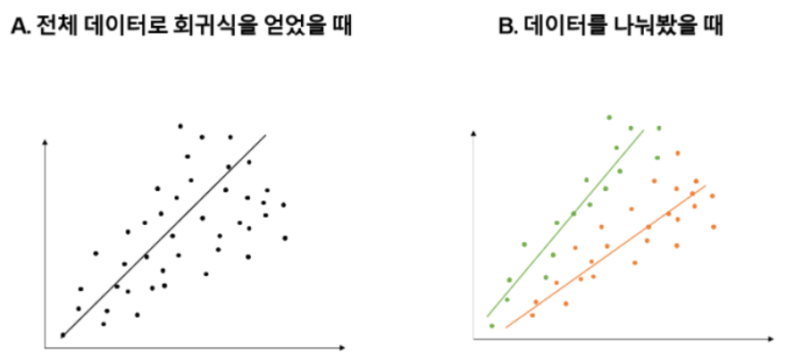
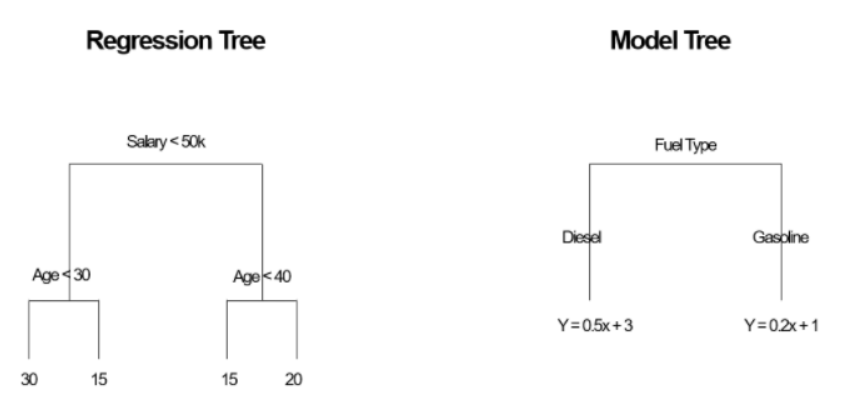
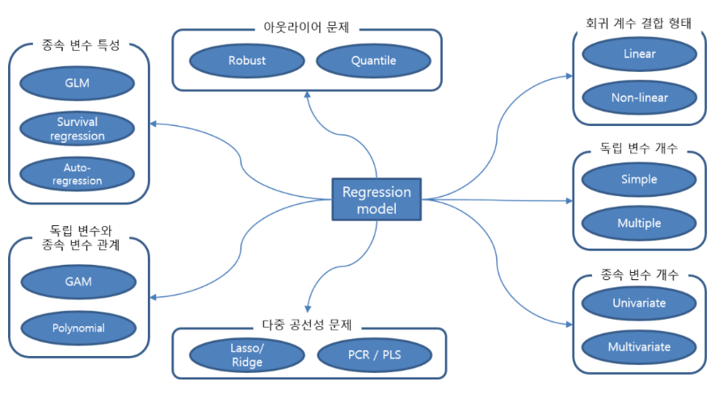
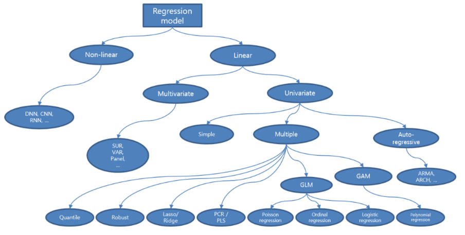

# 회귀모델(Regression)

  어떤 자료에 대해서 그 값에 영향을 주는 조건을 고려하여 구한 평균

## 회귀트리

### 회귀트리가 필요한 이유?

 왼쪽 데이터는 전체 데이터를 회귀식의 입력값으로 사용했을 때 얻을 수 있는 회귀식이다. 데이터가 선형관계이나 회귀식과 데이터 포인트간의 오차가 꽤 크기 때문에 잘 적합한 회귀식이라고 보기 힘들다.

 회귀트리는 이런 문제를 해결하기 위해 도입되었다. 오른쪽 그림은 동일 데이터를 초록색/주황색으로 나눠서 각각 회귀식을 적합한 결과다

### 회귀트리와 모델트리

 모델 트리는 간단히 말해 회귀 트리의 고급 버전이라고 생각하면 된다. 회귀 트리의 경우 잎 노드가 상수인데에 반해 모델 트리는 잎 노드에 선형 함수가 들어가게 된다. 

### 회귀 트리와 의사결정 나무의 차이점

근본적인 차이점은 의사결정 나무는 분류에 사용되고, 회귀 트리는 예측에 사용된다.

| 회귀 트리                           | 기준               | 의사결정 나무                                       |
| ----------------------------------- | ------------------ | --------------------------------------------------- |
| 예측                                | 목적               | 분류                                                |
| 잎노드의 변동(분산/표준편차) 최소화 | 나무를 나누는 기준 | 최대한 동종의 클래스가 되도록 - 즉, 불순도가 낮도록 |
| RMSE                                | 가지치기 기준      | 일반화 오차의 추정값 기준                           |

## 종류 

### 회귀모델의 종류 도식화

위의 회귀모델을 트리모형으로 도식화하면 

