# 서포트 벡터 머신(Support Vector Machine)

**서포트 벡터 머신(SVM: Support Vector Machine)**은 분류 과제에 사용할 수 있는 강력한 머신러닝 지도학습 모델이다. 


## 서포트 벡터 머신이란

**서포트 벡터 머신(이하 SVM)**은 **결정 경계(Decision Boundary)**, 즉 분류를 위한 기준 선을 정의하는 모델이다. 그래서 분류되지 않은 새로운 점이 나타나면 경계의 어느 쪽에 속하는지 확인해서 분류 과제를 수행할 수 있게 된다.

결국 이 **결정 경계**라는 걸 어떻게 정의하고 계산하는지 이해하는 게 중요하다는 뜻이다.

일단 예시를 보자.

만약 데이터에 2개 속성(feature)만 있다면 **결정 경계**는 이렇게 간단한 선 형태가 될 거다.

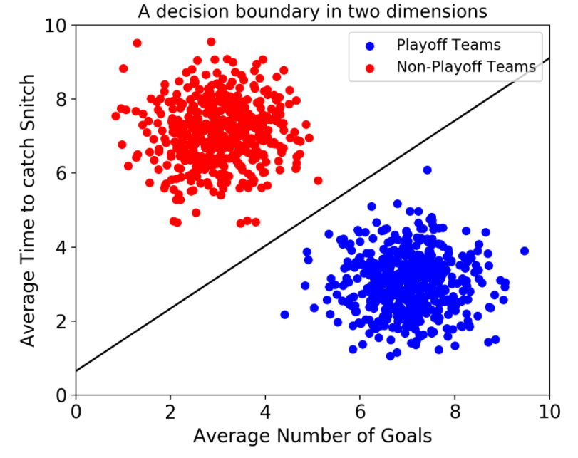

그러나 속성이 3개로 늘어난다면 이렇게 3차원으로 그려야 한다.

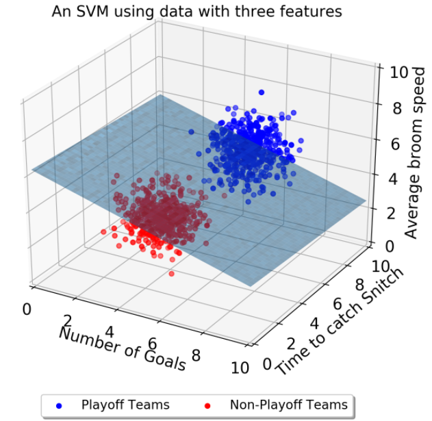

그리고 이 때의 **결정 경계**는 ‘선’이 아닌 ‘평면’이 된다.

우리가 이렇게 시각적으로 인지할 수 있는 범위는 딱 3차원까지다. 차원, 즉 속성의 개수가 늘어날수록 당연히 복잡해질 거다. **결정 경계**도 단순한 평면이 아닌 고차원이 될 텐데 이를 **“초평면(hyperplane)”**이라고 부른다.


## 최적의 결정 경계(Decision Boundary)

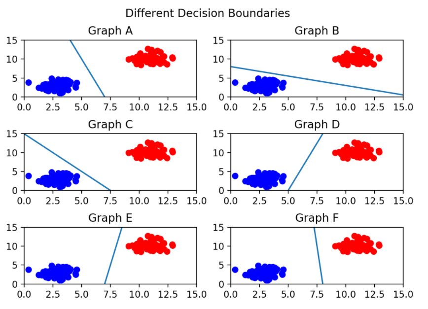

**어떤 그래프가 제일 위태로워 보이는가?**
 C를 보면 선이 파란색 부류와 너무 가까워서 아슬아슬해보인다.

**그렇다면 어떤 결정 경계가 가장 적절해보이는가?**
 당연히 F다. 두 클래스(분류) 사이에서 거리가 가장 멀기 때문이다.

위의 질문에서 알 수 있다시피 **결정 경계는 데이터 군으로부터 최대한 멀리 떨어지는 게 좋다**

 실제로 서포트 벡터 머신(Support Vector Machine)이라는 이름에서 **Support Vectors는 결정 경계와 가까이 있는 데이터 포인트들을 의미한다.** 이 데이터들이 경계를 정의하는 결정적인 역할을 하는 셈이다.


## 마진(Margin)

**마진(Margin)은 결정 경계와 서포트 벡터 사이의 거리**를 의미한다.

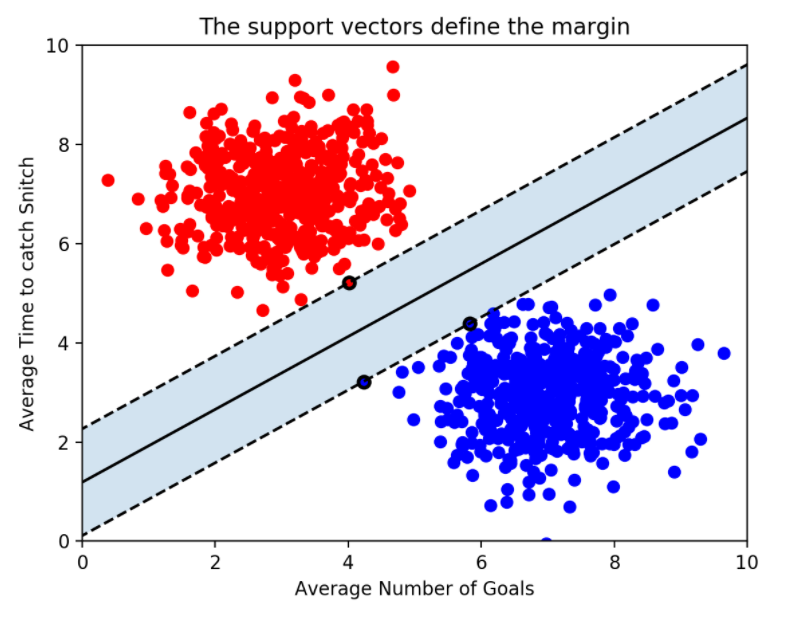

가운데 실선이 하나 그어져있는데, 이게 바로 ‘결정 경계’이다.

 그리고 그 실선으로부터 검은 테두리가 있는 빨간점 1개, 파란점 2개까지 영역을 두고 점선을 그어놓았다.

 점선으로부터 결정 경계까지의 거리가 바로 ‘**마진(margin)**’이다.

**최적의 결정 경계는 마진을 최대화한다.**

그리고 위 그림에서는 x축과 y축 2개의 속성을 가진 데이터로 결정 경계를 그었는 데, 총 3개의 데이터 포인트(서포트 벡터)가 필요했다.

 즉, **n개의 속성을 가진 데이터에는 최소 n+1개의 서포트 벡터가 존재한다**는 걸 알 수 있다.

이번엔 SVM 알고리즘의 장점을 하나 알 수 있다.

대부분의 머신러닝 지도 학습 알고리즘은 학습 데이터 모두를 사용하여 모델을 학습한다.

 그런데 **SVM에서는 결정 경계를 정의하는 게 결국 서포트 벡터이기 때문에 데이터 포인트 중에서 서포트 벡터만 잘 골라내면 나머지 쓸 데 없는 수많은 데이터 포인트들을 무시할 수 있다. 그래서 매우 빠르다.**


## 이상치(Outlier)의 허용

 SVM은 데이터 포인트들을 올바르게 분리하면서 마진의 크기를 최대화해야 하는데, 결국 이상치(outlier)를 잘 다루는 게 중요하다.

아래 그림을 보자. 선을 살펴보기에 앞서 왼쪽에 혼자 튀어 있는 파란 점과, 오른쪽에 혼자 튀어 있는 빨간 점이 **아웃라이어**다.

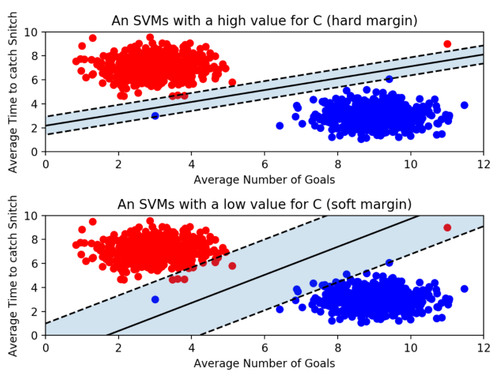

- 위의 그림은 아웃라이어를 허용하지 않고 기준을 까다롭게 세운 모양이다. 이걸 **하드 마진(hard margin)**이라고 부른다. 그리고 서포트 벡터와 결정 경계 사이의 거리가 매우 좁다. 즉, 마진이 매우 작아진다. 이렇게 개별적인 학습 데이터들을 다 놓치지 않으려고 아웃라이어를 허용하지 않는 기준으로 결정 경계를 정해버리면 **오버피팅(overfitting)** 문제가 발생할 수 있다.
- 아래 그림은 아웃라이어들이 마진 안에 어느정도 포함되도록 너그럽게 기준을 잡았다. 이걸 **소프트 마진(soft margin)**이라고 부른다. 이렇게 너그럽게 잡아 놓으니 서포트 벡터와 결정 경계 사이의 거리가 멀어졌다. 즉, 마진이 커진다. 대신 너무 대충대충 학습하는 꼴이라 **언더피팅(underfitting)** 문제가 발생할 수 있다.


### 파라미터 C

```python
from sklearn.svm import SVC
classifier = SVC(kernel = 'linear')
training_points = [[1, 2], [1, 5], [2, 2], [7, 5], [9, 4], [8, 2]]
labels = [1, 1, 1, 0, 0, 0]

classifier.fit(training_points, labels) 

print(classifier.predict([[3, 2]]))
# 3,2점을 모델에 넣어 예측

print(classifier.support_vectors_)
# 위 예측에서 사용된 서포트 벡터를 확인
```


 **scikit-learn에서는 SVM 모델이 오류를 어느정도 허용할 것인지 파라미터 `C`를 통해 지정할 수 있다.** (기본 값은 1이다.)

`classifier = SVC(C = 0.01)`

**`C`값이 클수록 하드마진(오류 허용 안 함), 작을수록 소프트마진(오류를 허용함)**이다.

`C`의 최적 값은 데이터에 따라 다르다. 결국 여러가지 C값을 넣어보면서 모델을 검증하는 수밖에 없다.


## 커널(Kernel)

지금까지는 선형으로 결정 경계를 그을 수 있는 형태의 데이터 세트를 예시로 들었다. 그런데 만약 SVM이 선형으로 분리 할 수 없는 데이터 세트가 있다면 어떻게 해야 할까?

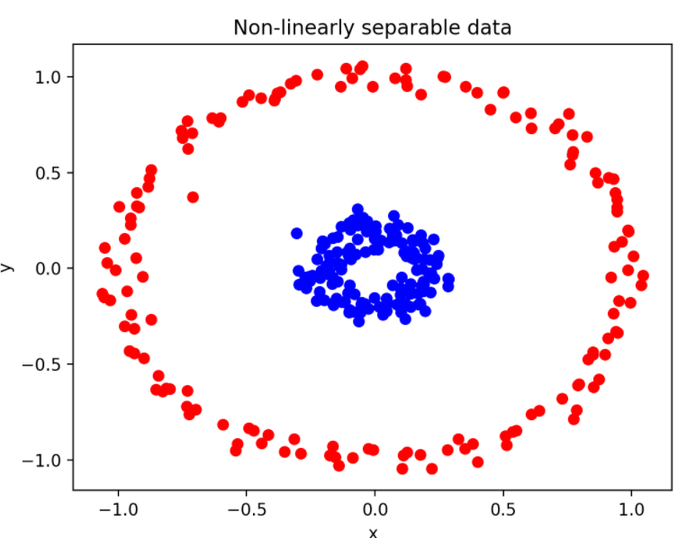

`SVC(kernel = 'poly')`(다항식) 같은 걸 넣어줄 수도 있다. 


### 1. 다항식 (Polynomial)

**다항식(polynomial)** 커널을 사용하면 2차원에서 x, y 좌표로 이루어진 점들을 아래와 같은 식에 따라 3차원으로 표현하게 된다.

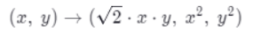

예를 들어 [1, 2] 점이 있다고 하면 이렇게 3차원으로 계산해놓는다.

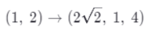

그리고 이렇게 다항식 커널로 계산한 데이터 포인트들을 3차원으로 그려보면 이런 모양이 나타난다.


이렇게 **다항식(polynomial) 커널을 사용하면 데이터를 더 높은 차원으로 변형하여 나타냄으로써 초평면(hyperplane)의 결정 경계를 얻을 수 있다.**


### 2. 방사 기저 함수 (RBF: Radial Bias Function)

보통 **RBF 커널** 혹은 **가우시안 커널**이라고 부르기도 한다

sciklit-learn에서 모델을 불러올 때 파라미터로 `kernel` 값을 따로 안 넣어주었을 때의 기본값이 바로 이 `'rbf'`다.

이 **RBF 커널**은 2차원의 점을 무한한 차원의 점으로 변환한다.

여기서  하나 알고 가야 할 게 있다. 바로 **감마(gamma)**다.

### 파라미터 gamma

`gamma`는 (위에서 소개한 `C`와 마찬가지로) 파라미터다.

classifier = SVC**(**kernel = "rbf", C = 2, gamma = 0.5**)**

**`gamma`**는 **결정 경계를 얼마나 유연하게 그을 것인지** 정해주는 거다. 학습 데이터에 얼마나 민감하게 반응할 것인지 모델을 조정하는 거니까 C와 비슷한 개념이라 봐도 된다.

- `gamma`값을 **높이면** 학습 데이터에 많이 의존해서 **결정 경계를 구불구불** 긋게 된다. 이는 **오버피팅**을 초래할 수 있다.
- 반대로 `gamma`를 **낮추면** 학습 데이터에 별로 의존하지 않고 **결정 경계를 직선에 가깝게** 긋게 된다. 이러면 **언더피팅**이 발생할 수 있다.

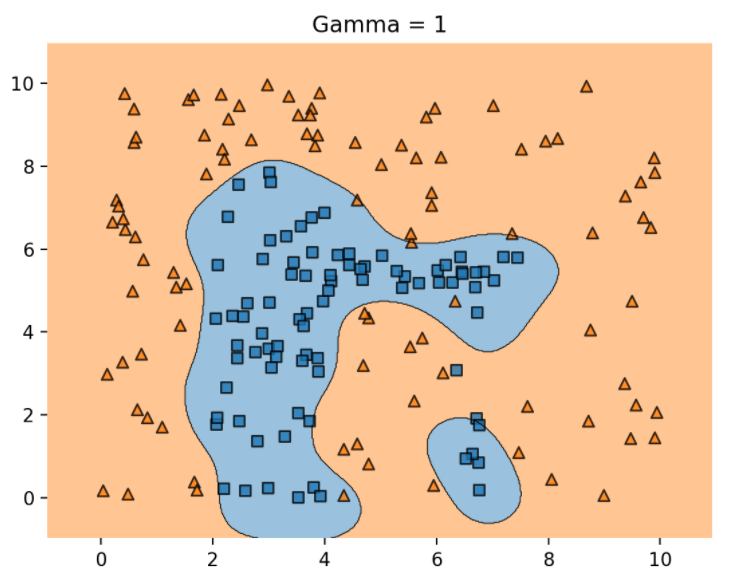

최적 값의 감마를 설정하면 나오는 모델이다.

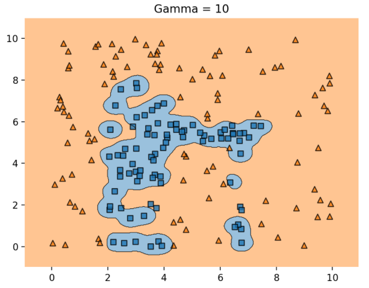

오버피팅된 감마이다.

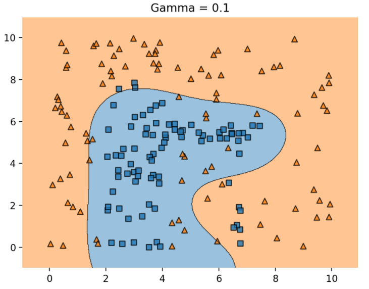

언더 피팅된 감마이다.


## 요약

- SVM은 분류에 사용되는 지도학습 머신러닝 모델이다.
- SVM은 **서포트 벡터(support vectors)**를 사용해서 결정 경계(Decision Boundary)를 정의하고, 분류되지 않은 점을 해당 결정 경계와 비교해서 분류한다.
- **서포트 벡터(support vectors)**는 결정 경계에 가장 가까운 각 클래스의 점들이다.
- 서포트 벡터와 결정 경계 사이의 거리를 **마진(margin)**이라고 한다.
- SVM은 허용 가능한 오류 범위 내에서 가능한 최대 마진을 만들려고 한다.
- **파라미터 `C`**는 허용되는 오류 양을 조절한다. **C 값이 클수록** 오류를 덜 허용하며 이를 **하드 마진(hard margin)**이라 부른다. 반대로 C 값이 작을수록 오류를 더 많이 허용해서 **소프트 마진(soft margin)**을 만든다.
- SVM에서는 **선형으로 분리할 수 없는 점들**을 분류하기 위해 **커널(kernel)**을 사용한다.
- **커널(kernel)**은 원래 가지고 있는 데이터를 더 높은 차원의 데이터로 변환한다. 2차원의 점으로 나타낼 수 있는 데이터를 ***\*다항식\**(polynomial) 커널**은 3차원으로, **RBF 커널**은 점을 무한한 차원으로 변환한다.
- **RBF 커널**에는 **파라미터 감마(`gamma`)**가 있다. 감마가 너무 크면 학습 데이터에 너무 의존해서 **오버피팅**이 발생할 수 있다.


출처] http://hleecaster.com/ml-svm-concept/