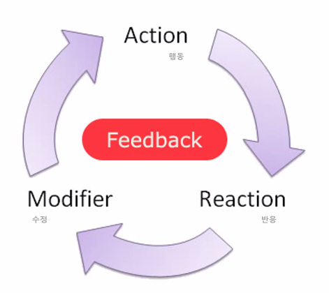
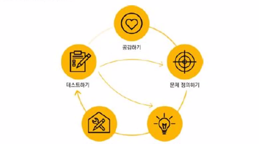

# UI_UX 기획

1. **STEP1 문제 찾고 조사하기** :star:
2. STEP2 생각을 구체화 하기
3. STEP3 해결방안 찾기
4. STEP4 시각화하기

## UX-UI의 이해

- UX란?

사용자 경험이란 총체적인 관점으로 컨셉을 잡고 개발방향을 정하기

- UI란?

 제작단계에서 사용자에게 최적화되도록 디자인하기

## 사례

### 행동 유도성

타겟 유저들의 행동을 예측

- 비상구 문고리는 바형태
- 막대기 형태의 문고리는 내리거나 올리는 형식으로 열 수 있음

- 비상구 디자인

### 루브르 박물관의 파란색 조명

 글레스코 지방에서 파란색이 심신을 안정시키는 효과가 있다고 하여, 조명을 파란색을 바꿔보았더니 범죄율이 30% 줄었다.

- 부천에서 파란색 조명을 바꾸었지만 주민들의 민원으로 철거되었다.
  - 각 나라의 문화를 고려하지 않음

### 마포대교 자살방지 문구

- 타겟 유저에 대한 이해가 부족해서 자살률이 높아졌다.

## UX / UI 서비스 기획

### 잊지말아야 서비스 기획의 세 가지

- ### 기능성보단 사용성

  - 과거 물자가 귀해서 선택을 강요받던 시대에서는 기능성에 중심을 두었지만, 지금은 선택을 하는 사용자의 사용성(UX)이 중요

  - #### 뒤샹의 샘

    

    특별한 미학적 특징이 없는 공장의 대량생산품 중 하나를 선택해 그 제품을 본래의 기능적 역할로부터 자유롭게 풀어줌으로써 기능적 쓸모가 아닌, 실질적인 예술품으로 승화시키는 것이다. 그 대상을 바라보는 사람들의 관점과 배경지식을 뒤집음으로써 가능해진다. 뒤샹은 자신이 고안해낸 이 새로운 예술방식을 기성조각품이라는 뜻으로 ‘레디메이드(readymade)’라 명명했다.

- ### 피드백

- 사용자의 반응 통해 제공자가 개선 => 즉각적인 반응과 적용

  ex) 아프리카tv , 잼라이브..

- 재미

- 중요점

  - 현상의 이해, 니즈의 변화 파악, 소비자 만족제고
  - ==> 컨텐츠의 성공

- ### 의미의 전달

다양한 리서치과정을 통해서 의미있는 정보를 캐내야함

숨어있는 정보를 찾기 위해서 다양한 리서치와 모델평가를 진행

의미를 캐내는 과정은 스토리, 스토리텔링이 중요하다

	- 서비스를 사용하는 사람을 감동시켜야한다. (이스터에그)
 - 유머와 재미 감동으로 **인간적인 감성**에 어필해야한다.
   	- **"주장하기 위해서는 근거를 대지만 느낌을 전달하려면 인간성을 입증해야한다."**

## 문고리 디자인 - 간단 아이디어

1. 강아지 문고리!
2. 문고리칼퀴? 문고리에 걸려있는 물건들 안떨어지게
3. 버튼식 문고리
4. 투명문 하이라이트
5. 내 아이디어 =  몸통박치기 + 옆으로 밀어서 열수 있는 문고리

## 아이디어 도출하기

### 문화 컨텐츠

**"재미있는 [문화]적인 요소를 [디지털매체]를 통해서 사람들에게 전달하여 [상업적 이윤]을 창출하는 것"**

 - 게임, 영화...

### 스마트 문화 컨텐츠란

#### **스마트 기기 + 문화 컨텐츠**

- 애플카, 구글카, 스마트워치, 스마트 홈 서비스,,

#### 특징

- 수평적 구조와 아이디어가 핵심

   == 누구나 아이디어를 구현할 수 있다

- 브레인스토밍, 브레인 라이팅 등등을 통해 개발과정을 거침

## 컨텐츠 기획

### 컨셉(concept)의 이해

- Concept = 목적을 이루기 위한 방향
- 의도 - 기획 - 실행 각 단계가 중요

- 공감 
  - 아이들이 무서워하지 않는 병원....

### 스토리텔링 하기

- 마케팅에 활용 
- [이야기]를 통한 [감동]  - 근거를 통한 당위성
  - ~에 근거한~ 책
- 전설과 역사
  - 포드와 페라리, 애플, 샤넬 넘버 5
- 역경을 이겨낸 감동
  - 서울대 수석의 '고등학교 때 공부가 너무 싫었어요'

### 스토리 보드로 시각화하기

그림으로 시각화

- BUSINESS MODEL
  - 목표고객에 대한 명확한 가치제안으로 많은 고객을 유인하여 수익과 연결할 때 가치 창출
  - 샤오미 - 샤오미를 통한 생활

