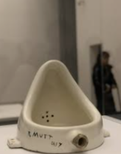

# UI_UX 기획

1. **STEP1 문제 찾고 조사하기**

2. STEP2 생각을 구체화 하기

3. STEP3 해결방안 찾기

4. STEP4 시각화하기

## UX-UI의 이해

- UX란?

사용자 경험이란 총체적인 관점으로 컨셉을 잡고 개발방향을 정하기

- UI란?

 제작단계에서 사용자에게 최적화되도록 디자인하기

## 사례

### 행동 유도성

타겟 유저들의 행동을 예측

- 비상구 문고리는 바형태
- 막대기 형태의 문고리는 내리거나 올리는 형식으로 열 수 있음

- 비상구 디자인

### 루브르 박물관의 파란색 조명

 글레스코 지방에서 파란색이 심신을 안정시키는 효과가 있다고 하여, 조명을 파란색을 바꿔보았더니 범죄율이 30% 줄었다.

- 부천에서 파란색 조명을 바꾸었지만 주민들의 민원으로 철거되었다.
  - 각 나라의 문화를 고려하지 않음

### 마포대교 자살방지 문구

- 타겟 유저에 대한 이해가 부족해서 자살률이 높아졌다.

## UX / UI 서비스 기획

- 기능성과 사용성
- 과거 물자가 귀해서 선택을 강요받던 시대에서는 기능성에 중심ㅇ르 주었지만, 지금은 선택을 하는 사용자의 사용성(UX)이 중요
- 

뒤샹의 샘

