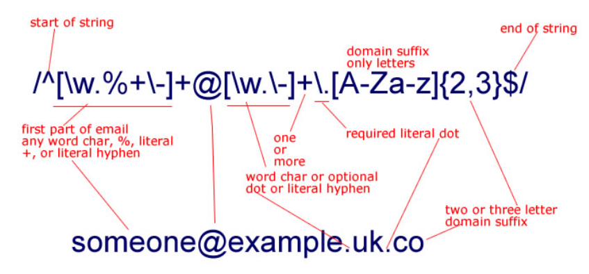

# 정규표현식 (Regex)



**자주쓰는 정규식**

전화 번호 검색 : \d{3}[.-]?\d{3}[.-]?\d{4}

\d{1,3}\.\d{1,3}\.\d{1,3}\.\d{1,3}

## 정규 표현식의 용어들

 정규 표현식에서 사용되는 기호를 Meta문자라고  표현한다. 

 표현식에서 내부적으로 특정 의미를 가지는 문자를 말하며 간단하게 정리하면 아래의 표와 같다.

| 표현식   | 의미                                                         |
| -------- | ------------------------------------------------------------ |
| ^x       | 문자열의 시작을 표현하며 x 문자로 시작됨을 의미한다.         |
| x$       | 문자열의 종료를 표현하며 x 문자로 종료됨을 의미한다.         |
| .x       | 임의의 한 문자의 자리수를 표현하며 문자열이 x 로 끝난다는 것을 의미한다. |
| x+       | 반복을 표현하며 x 문자가 한번 이상 반복됨을 의미한다.        |
| x?       | 존재여부를 표현하며 x 문자가 존재할 수도, 존재하지 않을 수도 있음을 의미한다. |
| x*       | 반복여부를 표현하며 x 문자가 0번 또는 그 이상 반복됨을 의미한다. |
| x\|y     | or 를 표현하며 x 또는 y 문자가 존재함을 의미한다.            |
| (x)      | 그룹을 표현하며 x 를 그룹으로 처리함을 의미한다.             |
| (x)(y)   | 그룹들의 집합을 표현하며 앞에서 부터 순서대로 번호를 부여하여 관리하고 x, y 는 각 그룹의 데이터로 관리된다. |
| (x)(?:y) | 그룹들의 집합에 대한 예외를 표현하며 그룹 집합으로 관리되지 않음을 의미한다. |
| x{n}     | 반복을 표현하며 x 문자가 n번 반복됨을 의미한다.              |
| x{n,}    | 반복을 표현하며 x 문자가 n번 이상 반복됨을 의미한다.         |
| x{n,m}   | 반복을 표현하며 x 문자가 최소 n번 이상 최대 m 번 이하로 반복됨을 의미한다. |


 Meta 문자들 중에서 좀 더 특수하게 사용되는 문자들이 존재한다.

 '[]' 는 내부에 지정된 문자열의 범위 중에서 한 문자만을 선택하다는 특수한 의미를 가진다. 그리고 내부에서 Meta문자를 사용하면 다른 의미를 가지고 동작할 수 있으므로 잘 확인하고 사용해야 한다. 좀 더 특별한 용도로 사용되는 것들은 아래의 표와 같다. 


| 표현식 | 의미                                                         |
| ------ | ------------------------------------------------------------ |
| [xy]   | 문자 선택을 표현하며 x 와 y 중에 하나를 의미한다.            |
| [^xy]  | not 을 표현하며  x 및 y 를 제외한 문자를 의미한다.           |
| [x-z]  | range를 표현하며 x ~ z 사이의 문자를 의미한다.               |
| \^     | escape 를 표현하며 ^ 를 문자로 사용함을 의미한다.            |
| \b     | word boundary를 표현하며 문자와 공백사이의 문자를 의미한다.  |
| \B     | non word boundary를 표현하며 문자와 공백사이가 아닌 문자를 의미한다. |
| \d     | digit 를 표현하며 숫자를 의미한다.                           |
| \D     | non digit 를 표현하며 숫자가 아닌 것을 의미한다.             |
| \s     | space 를 표현하며 공백 문자를 의미한다.                      |
| \S     | non space를 표현하며 공백 문자가 아닌 것을 의미한다.         |
| \t     | tab 을 표현하며 탭 문자를 의미한다.                          |
| \v     | vertical tab을 표현하며 수직 탭(?) 문자를 의미한다.          |
| \w     | word 를 표현하며 알파벳 + 숫자 + _ 중의 한 문자임을 의미한다. |
| \W     | non word를 표현하며 알파벳 + 숫자 + _ 가 아닌 문자를 의미한다. |


 정규표현식을 사용할 때 Flag 라는 것이 존재하는데 Flag를 사용하지 않으면 문자열에 대해서 검색을 한번만 처리하고 종료하게 된다. Flag는 다음과 같은 것들이 존재한다.

| Flag | 의미                                                         |
| ---- | ------------------------------------------------------------ |
| g    | Global 의 표현하며 대상 문자열내에 모든 패턴들을 검색하는 것을 의미한다. |
| i    | Ignore case 를 표현하며 대상 문자열에 대해서 대/소문자를 식별하지 않는 것을 의미한다. |
| m    | Multi line을 표현하며 대상 문자열이 다중 라인의 문자열인 경우에도 검색하는 것을 의미한다. |

**
사용 예제** 

**개별 숫자 - /[0-9]/g**

전체에서  0~9사이에 아무 숫자 '하나'  찾음 

**개발 문자 - /[to]/g**

전체에서 t  혹은 o  를 모두 찾음 

**단어 - /filter/g**

전체에서  f 따로 i 따로 찾는게 아니라 'filter' 라는 단어에 매칭되는것을 찾음 

**단어 제외 - /\b(?:(?!to)\w)+\b/g**

전체에서 'to' 라는 단어를 빼고 다른 단어 매칭 

확인결과 > "Tutorial" 도 제외됨. 

**단어 제외 - \b(?!\bto\b)\w+\b**

전체에서 'to' 라는 단어를 빼고 다른 단어 매칭 

확인결과 >  "Tutorial" 는 제외 안됨.  이게 더 정확하다고 볼수있을듯. 


```regex
\b        # assert at a word boundary
(?!       # look ahead and assert that what follows IS NOT... 
  \b      #   a word boundary
  word    #   followed by the exact characters `word`
  \b      #   followed by a word boundary
)         # end look-ahead assertion
\w+       # match one or more word characters: `[a-zA-Z0-9_]`
\b        # then a word boundary
```

**이메일 - /^[0-9a-zA-Z]([-_\.]?[0-9a-zA-Z])\*@[0-9a-zA-Z]([-_\.]?[0-9a-zA-Z])\*\.[a-zA-Z]{2,3}$/i**

'시작을'  0~9 사이 숫자 or a-z A-Z 알바펫 아무거나로 시작하고  /  중간에 - _  . 같은 문자가 있을수도 있고 없을수도 있으며 / 

그 후에 0~9 사이 숫자 or a-z A-Z 알바펫중 하나의 문자가 없거나 연달아 나올수 있으며 /  @ 가 반드시 존재하고  / 

0-9a-zA-Z 여기서 하나가 있고 / 중간에 - _  . 같은 문자가 있을수도 있고 없을수도 있으며 / 그 후에 0~9 사이 숫자 or a-z A-Z 알바펫중 하나의 

문자가 없거나 연달아 나올수 있으며 /  반드시  .  이 존재하고  / [a-zA-Z] 의 문자가 2개나 3개가 존재 /  이 모든것은 대소문자 구분안함 

**전화번호 - /^\d{3}-\d{3,4}-\d{4}$/**

시작을 숫자 3개로하며 /  중간에 하이픈 -  하나 존재 /  숫자가 3~4개 존재하며 /  하이픈 하나 존재 /  숫자 4개로 끝남 

**핸드폰 번호 - /^01([0|1|6|7|8|9]?)-?([0-9]{3,4})-?([0-9]{4})$/**

시작을 숫자 01로 시작하며 그 후에 0,1,6,7,8,9 중에 하나가 나올수도 있으며 /  하이픈 - 하나 존재할수도 있으며 /  숫자 3~4개 이어지고 / 

또 하이픈 - 하나 존재할수도 있으며 /  숫자 4개가 이어짐 

**URL - ^(https?):\/\/([^:\/\s]+)(:([^\/]\*))?((\/[^\s/\/]+)\*)?\/?([^#\s\?]\*)(\?([^#\s]\*))?(#(\w\*))?$**

^(https?):\/\/

([^:\/\s]+)

(:([^\/]*))?


((\/[^\s/\/]+)*)?\/?([^#\s\?]*)(\?([^#\s]*))?(#(\w*))?


출처: https://hamait.tistory.com/342 

참고자료 -

http://stackoverflow.com/questions/7820930/regex-how-to-exclude-single-word -- 이론 
http://ccambo.blogspot.kr/2014/10/regular-expression.html  -- 이론 
http://regexr.com/ -- 테스트 


**<정규표현식 실습>** -- 우분투 사용

```python 
grep class=\"title-text\" index.html | sed 's/.*\"title-text\">//'
grep class=\"title-text\" index.html | sed 's/.*\"title-text\">//;s/<\/span>//'
grep class=\"title-text\" index.html | 
sed 's/.*\"title-text\">//;s/<\/span>/ -- 뒤에 붙일 내용 -- /'


~~ > ~.txt  # 텍스트로 저장

vi title.txt  # txt 파일 보기
more ./~~.txt
```

```python
# 파이썬으로 웹 크롤링

pip install requests==2.25.1
pip install lxml==4.6.3
pip install cssselect2


import requests
import lxml.html
# HTML 소스 코드를 읽어 들입니다.
r = requests.get("http://wikibook.co.kr/python-for-web-scraping/")
html = r.text
#r.text
# HTML을 HtmlElement 객체로 변환합니다.
root = lxml.html.fromstring(html)

# XPath를 사용해서 요소를 추출합니다.
#titleElement = root.xpath('//*[@id="content"]/div[1]/div[2]/ul/li[1]')
titleElement = root.xpath('//*[@id="content"]/div[1]/div[2]/h1')
type(titleElement)
--> list
# 리스트의 첫 번째 요소가 가진 텍스트를 출력합니다.
print(titleElement[0].text)
--> 파이썬을 이용한 웹 크롤링과 스크레이핑
titleElement[0].tag
--> 'h1'
titleElement[0].attrib
--> {'class': 'main-title'}


import cssselect
# CSS 선택자를 사용해서 요소를 추출합니다.
linkAs = root.cssselect('#content > div:nth-child(1) > div.col-md-9 > h1')
len(linkAs)
--> 1
## for 반복문으로 추출한 요소의 href 속성을 추출합니다.
for linkA in linkAs:
    print(linkA.attrib["class"])
--> main-title
```


```python
pip install feedparser

import feedparser
# URL을 지정해서 FeedParserDict 객체를 생성합니다.
rss = feedparser.parse("http://www.aladin.co.kr/rss/special_new/351")

# RSS의 버전을 출력합니다.
print(rss.version)

# 피드의 타이틀과 콘텐츠의 생성 날짜를 출력합니다.
print(rss["feed"]["title"])

# 엔트리들의 제목과 링크를 출력합니다.
for content in rss["entries"]:
    print(content["title"])
    print(content["link"])
```

