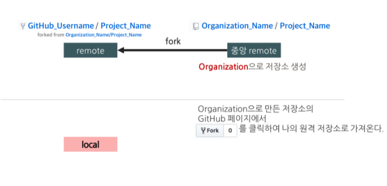
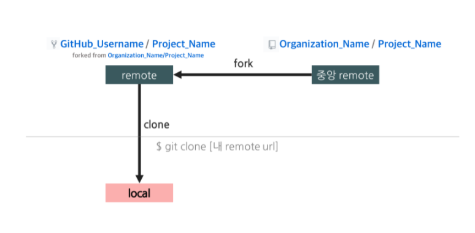
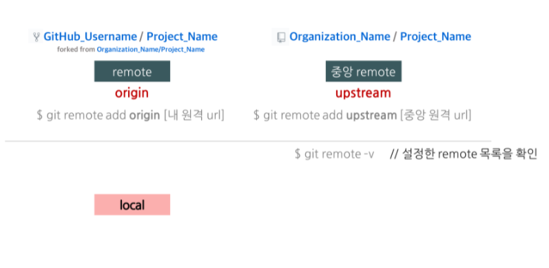
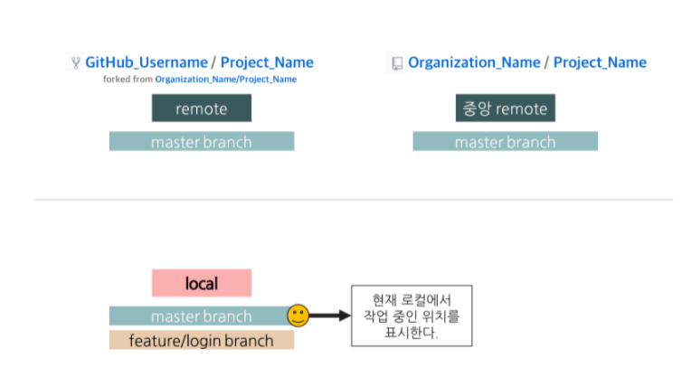
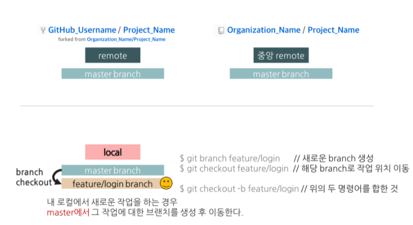
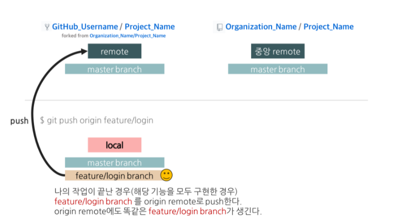
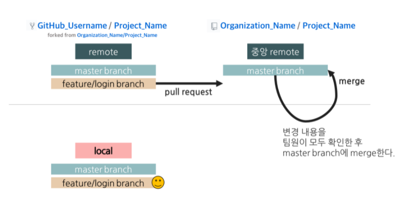
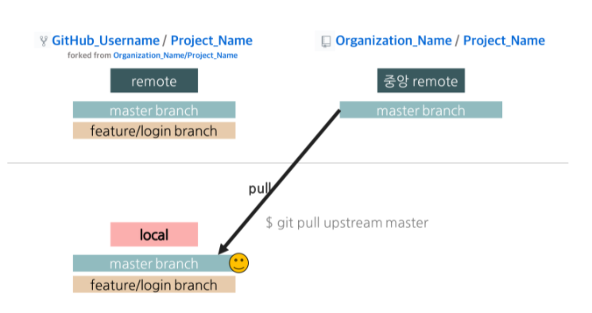

# github 협업

## 1. 중앙 원격 저장소, 자신의 원격 저장소, 로컬 저장소의 개념

- 중앙 원격(remote) 저장소
  - 여러 명이 같은 프로젝트를 관리하는 데 사용하는 그룹 계정의 중립된 원격 저장소
    - Organization을 만드는 방법은 GitHub 페이지 오른쪽 위에 있는 “+” 아이콘을 클릭하고 메뉴에서 “New organization”을 선택하면 된다.
    - Organizatoin의 사용자와 저장소는 팀으로 관리되고 저장소의 권한 설정도 팀으로 관리한다.

- 자신의 원격(remote) 저장소
  - remote repository 라고 불린다.
  - 파일이 GitHub 전용 서버에서 관리되는 원격 저장소

- 로컬(local) 저장소
  - local repository 라고 불린다.
  - 내 PC에 파일이 저장되는 개인 전용 저장소, 지역 저장소


## 2. 중앙 원격 저장소를 포크(fork)해서 자신만의 원격 저장소를 만든다.

중앙 원격 저장소를 복제한 저장소는 개인의 공개 저장소(remote repository) 역할을 한다.
다른 개발자는 자신의 원격 저장소에 푸시할 수 없다(내려 받는 것은 가능하다).



## 3. 프로젝트 참여자는 git clone 명령으로 로컬 저장소를 만든다.

 git clone 명령으로 자신의 원격 저장소(remote repository)를 복제하여 로컬 저장소(local repository)를 만들 수 있다. 프로젝트 참여자는 이 로컬 저장소에서 작업을 수행한다.

```
git clone [내 remote repository URL]
```




## 4. 두 개의 원격 저장소를 연결한다.

하나는 포크한 자신의 원격 저장소(remote repository)이고, 다른 하나는 프로젝트 중앙 원격 저장소이다.
이름은 아무렇게나 붙여도 되지만, 일반적으로 포크한 원격 저장소는 origin(git clone할 때 자동으로 만들어진다), 프로젝트 중앙 원격 저장소는 upstream으로 붙이는 것이 일반적이다. upstream 별칭은 자동으로 생성되지 않으므로, 아래의 명령을 참고해서 직접 지정해줘야 한다.
이렇게 연결해 줘야만 로컬 저장소(local repository)를 프로젝트 중앙 원격 저장소와 같은 상태로 유지할 수 있다.

```
git remote add upstream [중앙 원격 저장소 URL]
```



## 5. 설명을 위해 현재 로컬에서 작업 중인 branch 위치를 표시한다.

중앙 원격 저장소와 자신의 원격 저장소에는 각각 master branch가 있고, 자신의 로컬 저장소에는 master branch와 로그인 기능을 구현할 feature/login branch(아래에서 설명)가 있다고 가정한다.
또한 현재 master branch에서 작업 중이라고 가정하고 아래와 같이 작업 중인 위치를 표시한다.




## 6. 새로운 기능 개발을 위해 격리된 branch를 만든다.

로컬 저장소에서 branch를 따고, 코드를 수정하고, 변경 내용을 커밋한다.

```
git checkout -b [branch name]

# 위의 명령어는 아래의 두 명령어를 합한 것
git branch [branch name]
git checkout [branch name]
```



## 7. 로컬 저장소의 커밋 이력을 자신의 원격 저장소(remote repository)에 푸시한다.

기능을 구현한 후 커밋한 이력을 푸시할 때는 프로젝트의 중앙 원격 저장소가 아니라, 자신의 원격 복제본 저장소(remote repository)에 푸시한다.

```
git commit -a -m "Write commit message"

# 위의 명령어는 아래의 두 명령어를 합한 것

git add . # 변경된 모든 파일을 스테이징 영역에 추가
git add [some-file] # 스테이징 영역에 some-file 추가
git commit -m "Write commit message" # local 작업폴더에 history 하나를 쌓는 것
```

자신의 원격 저장소에 변경 내용을 올리기 전까지는 변경 내용은 누구에게도 공개되지 않는다. 자신의 원격 저장소에 변경 내역을 올려서 다른 개발자가 볼 수 있도록 한다. origin으로 자신의 원격 저장소를 이미 등록해두었으므로 다음 명령만 하면 된다.

```
git push origin [branch name] # branch name에 해당하는 branch를 자신의 원격 저장소에 푸시
```




## 8. 프로젝트 관리자(소규모 팀에서는 모두가 관리자가 될 수 있음)에게 자신의 기여분을 반영해 달라는 풀 리퀘스트를 던진다.

프로젝트 관리자에게 자신의 기여분을 중앙 원격 코드 베이스에 반영해 달라고 요청해야 한다. GitHub 페이지에서 “Pull requests” 버튼을 이용하면, 어떤 branch를 제출할지 정할 수 있다. 기능을 구현한 branch(여기서는 feature/login branch)를 프로젝트 중앙 원격 저장소의 master branch에 병합해 달라고 요청한다.



## 9. 프로젝트 관리자는 변경 내용을 확인한 후 중앙 원격 코드 베이스에 병합(merge)한다.

이후에는 모든 팀원이 변경한 코드 내용을 확인하고 마지막으로 확인한 팀원이 변경 내용을 중앙 원격 코드 베이스에 병합(merge)하는 작업을 한다. 병합하는 과정은 아래와 같다.

1. GitHub 페이지에서 “Pull requests” 버튼을 누른 후, File changed 탭에서 변경 내용을 확인한다.
2. Conversation 탭으로 이동하여 “Confirm merge”를 하면 중앙 원격 코드 베이스에 병합(merge)된다.
3. 충돌이 일어난 경우는 팀원들고 합의 하에 충돌 내용을 수정한 후 병합을 진행한다.


## 10. 중앙 원격 저장소와 자신의 로컬 저장소를 동기화하기 위해 로컬 저장소의 branch를 master branch로 이동한다.


## 11. 중앙 원격 저장소의 코드 베이스에 새로운 커밋이 있다면 다음과 같이 가져온다.

메인 코드 베이스가 변경되었으므로, 프로젝트 참여하는 모든 개발자가 자신의 로컬 저장소를 동기화해서 최신 상태로 만들어야 한다.

```
git pull upstream master
```




## 12. 새로운 기능을 추가하기 위해서 그 작업에 대한 branch를 생성하여 작업한다.

중앙 원격 저장소와 동기화된 로컬 저장소의 master branch에서 새로운 작업에 대한 branch를 생성하여 작업을 시작한다.


출처] https://gmlwjd9405.github.io/2017/10/28/how-to-collaborate-on-GitHub-2.html

