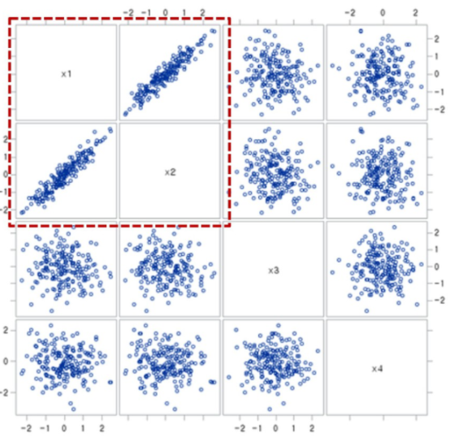

# 다중공선성

## 다중공선성이란 

 기본적으로 회귀분석의 전체는 독립변수들로 변수를 선정해야한다는 것이다. 다중공선성이 있다라는 것은 변수들 간의 상관관계가 높다는 것을 의미한다.

다중공선성이 높으면 예측 값의 신뢰구간이 넓게 형성되는 현상을 가진다.

## 다중 공선성을 제거하는 이유?

1. 상관성이 높은 것들이 많으면 분산을 교란시키고, 연산량을 높인다

   ==> 이 때 해결방법은 상관성이 높은 것들을 제거하거나

   ​		통합으로 해결한다( 대표값 활용--평균, 최빈값 등)

2.  차원의 저주 예방

   - 학습시켜할 웨이트는 상대적으로 크기가 큰 데 데이터량이 한정적일 때 차원의 저주에 걸릴 수 있다

   == > 차원수를 줄여서 해결한다

## 기타

- 딥러닝
  - 조건
    - 데이터가 많아야함
      	- 적을 때는 사전 훈련이 되어있어야한다
      	- 데이터를 넣기 전에 정규화등을 해야한다
    - 피처링이 모델 내에서 완료된다
- 트리구조
  - 중요점
    - 노드의 위치를 조절해야한다
      - 엔트로피가 높은 것(다양성이 높은 것)이 위로올라가게끔 조절