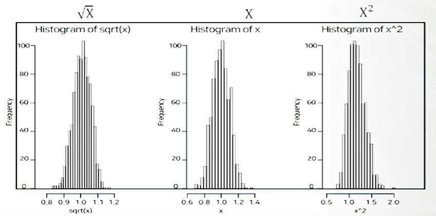
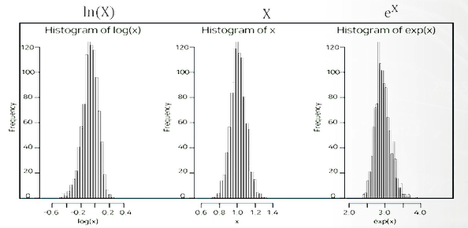

# 데이터 변환

## 제곱근 변환 vs 제곱 변환

제곱근 형태로 변환하면 왼쪽 꼬리가 길어짐 

- 왼쪽으로 잡아당김

제곱 변환은 오른쪽 꼬리가 길어짐

- 오른쪽으로 잡아당김

ex) 왼쪽 꼬리가 길다면 제곱 변환시 대칭형으로 변환 가능

​	오른쪽 꼬리가 길다면 제곱근 변환신 대칭형으로 변환 가능

## 로그 변환 vs 지수 변환

제곱근과 제곱 변환보다 치우침이 더 큼

로그변환시 왼쪽 꼬리가 길어짐

- 왼쪽으로 당기는 효과

지수 변환시 오른쪽 꼬리가 길어짐

- 오른쪽으로 당기는 효과

