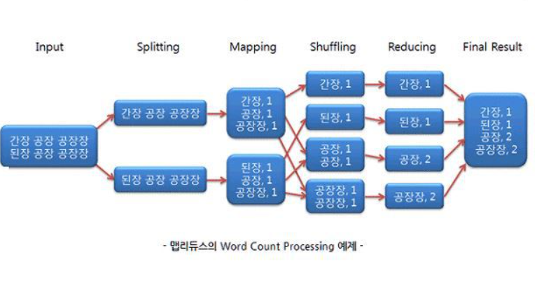
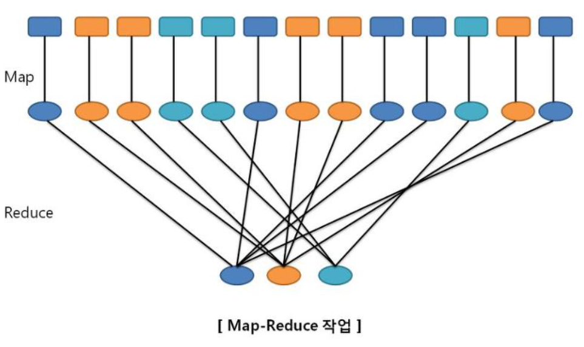
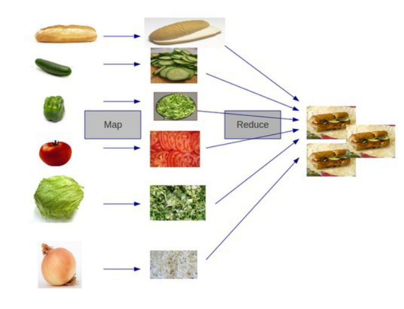

# 맵리듀스

 맵리듀스(MapReduce)란 구글에서 대용량 데이터 처리를 분산 병렬 컴퓨팅에서 처리하기 위한 목적으로 제작하여 2004년 발표한 소프트웨어 프레임워크입니다. 

맵리듀스를 간단하게 설명하자면, 한명이 4주 작업할 일을 4명이 나누어 1주일에 끝내는 것이라고 할 수 있습니다. 

이 개념이 하둡에서 사용하는 병렬 처리 개념이고, 4명의 작업자를 클러스터라고 합니다. 

맵리듀스란 맵(Map)+리듀스(Reduce)로 이루어져 있습니다. 

빅데이터에서 프로세스는 최대한 단순해야 합니다. 

RDBMS처럼 처리의 순서가 필요하거나 데이터 처리 실패로 인해 다시 되돌아가는 복잡한 연산은 어렵습니다. 

프로세스를 간단하기 위해서는 기준이 되는 값을 하나로 잡아야 합니다. 

맵에서는 key value를 이용하는데 key값을 이용하면 정렬과 그룹화가 간편해지는 장점이 있습니다. 

이를 위해 사용하는 것이 맵 구조를 이용하는 것입니다. 

맵리듀스 Job들은 JobTracker에 의해 제어됩니다. 잡트래커는 마스터 노드에 존재합니다. 이 잡트래커가 클러스터의 다른 노드들에 맵과 리듀스 task를 할당합니다. 

맵리듀스는 다음의 과정으로 이루어 집니다. 

Input -> Splitting -> Mapping -> Shuffling -> Reducing -> Final Result

Input과정은 말 그대로 데이터를 입력하는 과정입니다. 

Splitting은 데이터를 쪼개어(splitting) HDFS(Hadoop Distributed File System)에 저장하는 과정입니다. 

Shuffling은 맵 함수의 결과를 취합하기 위해 리듀스 함수로 데이터를 전달하는 과정입니다. 셔플링은 맵 태스크와 리듀스 태스크의 중간 단계입니다. 

Reducing에서 모든 값을 합쳐서 우리가 원하는 값을 추출할 수 있습니다. 

## 맵리듀스의 장점 

1. 단순하고 사용이 편리합니다.
2. 유연합니다. 특정 데이터 모델이나 스키마 정의, 질의 언어에 의존적이지 않아 비정형을 데이터 모델을 유연하게 지원 가능합니다. 
3. 저장 구조와 독립적입니다. 
4. 확장성이 높습니다.

## 맵리듀의 단점 

1. 복잡한 연산이 어렵습니다. 
2. 기존 DBMS가 제공하는 스키마, 질의 언어, 인덱스 등의 기능을 지원하지 않습니다. 
3. 상대적으로 성능이 낮습니다. 예를 들면, 모든 Map과정이 진행될 때 까지 Reduce는 시작될 수 없습니다. 즉, 맵리듀스는 병렬화를 수행할 수 없으므로 성능이 낮아질 수 밖에 없습니다. 