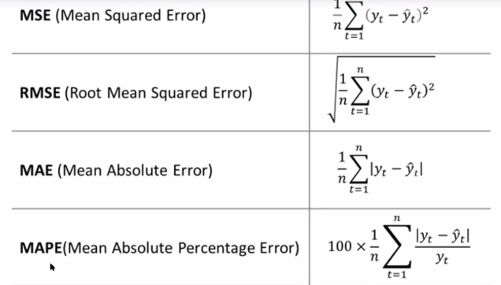
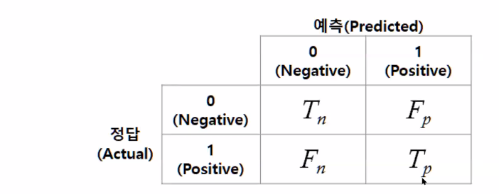
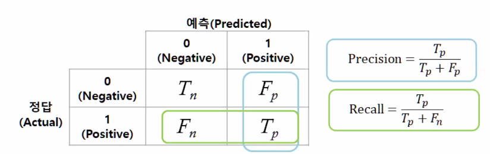
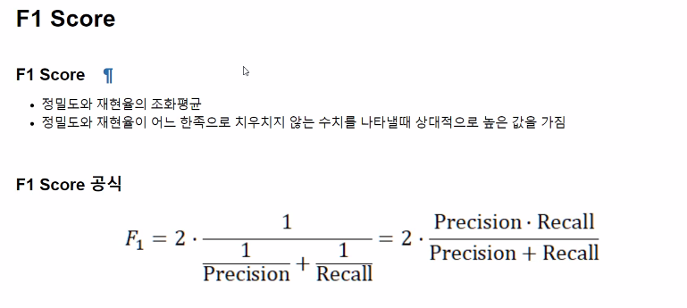

# 분류 모델 성능 평가 
= 예측 대상이 범주형
- 정확도(Accuracy)
- 재현율(Recall)
- 정밀도(Precision)
- F1 measure
- G measure
- ROC curve
- AUC

# 회귀 모델 평가 지표
= 예측 대상이 수치 데이터
- MSE(Mean Square Error)
- RMSE(Root Mean Square Error)
- MAE(Mean Absolute Error)
- MAPE(Mean Absolute Percentage Error)
- R^2

## Confusion Matrix(오차행렬)
**오차행렬**
- 이진 분류의 예측 오류가 얼마인지와 더불어 어떠한 유형의 예측 오류가 발생하고 있는지를 함께 나타내는 지표
- 예측 클래스와 실제 클래스의 값 유형에 따라 TN,FP,FN,TP형태

**정밀도와 재현율**

- 정밀도 = TP/(FP + TP)
- 재현율 = TP/(FN + TP)

#### 정밀도

- 예측을 positive로 한 대상 중에 실제 값이 positive로 일치한 데이터의 비율
- 양성 예측도라고도 함

#### 재현율

- 실제 값이 positive인 대상중에 예측값이 positive로 일치한 데이터 비율
- 민간도 또는 TPR이라고도 함

#### 재현율과 정밀도의 보완적 관계

- 재현율과 정밀도 모두 TP를 높이는 데이 동일하게 초점을 맞춤
- 재현율은 FN를 낮추는 데 초점을 맞추고 정밀도는 FP를 낮추는데 초점을 맞춤
- 사이킷런 API 사용
  - 정밀도 계산 = precision_score
  - 재현율 = recall_score
  - 정확도 = accuracy_score

#### F1 Score

