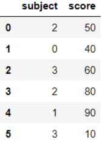
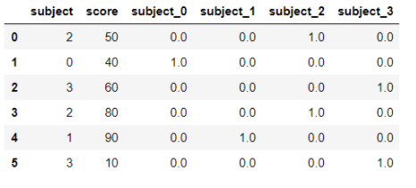
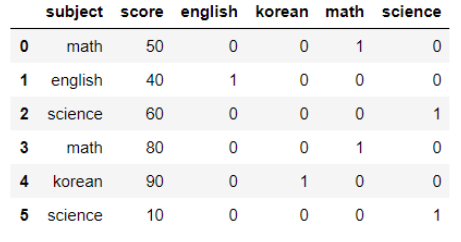
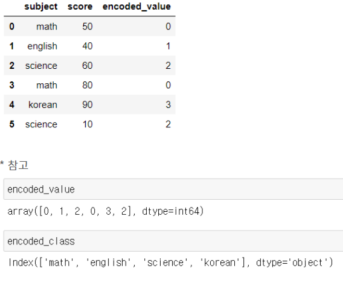

# 범주형 변수 처리 - 인코딩(Encoding)

## **순서**

- Label encoding
- One hot encoding
- get_dummies()
- factorize()


### **● Label encoding**

문자형을 정수형으로 인코딩

 'english', 'korean', 'math'를 0, 1, 2 처럼 변환

```python
from sklearn.preprocessing import LabelEncoder

encoder = LabelEncoder()
df_c['subject'] = encoder.fit_transform(df_c['subject'].values)
```



인코딩 값에 대한 원본값을 알고 싶을때에는 .classes_

인코딩 되기 전으로 되돌리고 싶을 때에는 inverse_transform() 을 사용

```python
display(encoder.classes_)
display(encoder.inverse_transform(df_c['subject']))
```

레이블 인코딩의 주의할 점

숫자의 특성 때문에 **가중치의 차이**가 생김 

'english'와 'science'의 중요도는 똑같은 반면에 인코딩을 하고 난 후에는 더 큰 숫자로 인코딩 된 'science'의 중요도가 높아짐

 트리 기반 알고리즘에서는 숫자의 크기에 따른 중요도 차이가 없지만,

그 외의 선형적 특징을 가지는 알고리즘들은 차이가 있기 때문에

 **one hot encoding 을 통해 해결**


### **● One hot encoding**

> label encoding이 선행

**숫자의 크고 작은 특성(중요도)을 없애기 위함**

```python
from sklearn.preprocessing import OneHotEncoder

oh_encoder = OneHotEncoder(sparse=False) # sparse 매개변수가 없다면 oh_df.toarray()를 해야함
oh_df = oh_encoder.fit_transform(np.array(df_c['subject']).reshape(-1,1)) # 인코딩 하기 전에 2차원 데이터로 변환

onehot_df = pd.DataFrame(oh_df, columns = ["subject_"+str(int(i)) for i in range(oh_df.shape[1])])
df_result = pd.concat([df_c, onehot_df], axis=1)
```



원 핫 인코딩을 할 때의 주의점

첫 번째로는 Label encoding을 선행하여 모든 문자열 값이 숫자형으로 변환되어 있어야 하는 것이고,

두 번째로 입력값으로 2차원 데이터가 필요하다는 점 (.reshape() 활용)


### **● get_dummies()**

> LabelEncoder() + OneHotEncoder() = get_dummies()

지금까지의 과정을 **한 번에 모두 처리**해주는 함수가 get_dummies()

판다스의 내장함수이기 때문에 별다른 설치 없이 바로 실행가능

```python
pd_df = pd.get_dummies(df['subject'])
df_result = pd.concat([df, pd_df], axis=1)
```




### **● factorize()**

> LabelEncoder() 와 같음

판다스의 내장함수

factorize() 함수는 두 개의 값을 반환하는데, **인코딩된 값**과 **인코딩된 범주**

```python
encoded_value, encoded_class = pd.factorize(df['subject'])
df['encoded_value'] = encoded_value
```



## **요약**

- get_dummies() 함수를 사용하는게 가장 빠르다.
- get_dummies() = (LabelEncoder() + OneHotEncoder()) or (factorize() + OneHotEncoder)
- LabelEncoder() = factorize()


출처] https://hwi-doc.tistory.com/entry/%EB%B2%94%EC%A3%BC%ED%98%95-%EB%B3%80%EC%88%98-%EC%B2%98%EB%A6%AC-%EB%B0%A9%EB%B2%95

