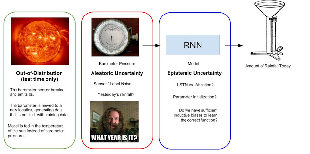
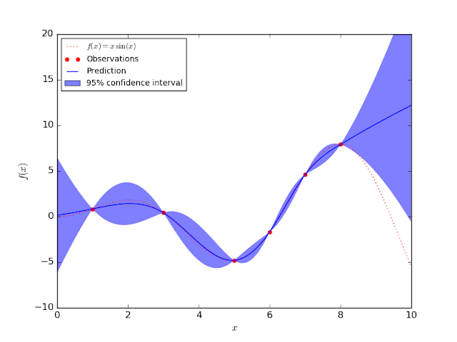

# 불확실성(Uncertaninty)

**불확실성(Uncertainty)**은 AI safety, risk management, portfolio optimization, scientific measurement, 그리고 insurance와 같은 분야에서 자주 언급된다.

예를 들면,

- "기계학습(머신러닝) 모델이 무엇을 모르는지를 스스로 알기를 원한다"
- "AI가 환자의 증상과 조치에 대해 추천을 할 때, 그것이 어느정도로 신뢰 가능한 정보인지를 우리에게 알려줄 책임이 있다"
- "Scientific calculations에서 significant figures는 측정의 불확실성을 나타냅니다"
- "우리는 agent가 불확실한 곳(rewards or predictions)을 자동으로 탐험하고 희소 보상(sparse rewards)을 발견하기를 원한다"
- "Portfolio optimization에서 우리는 위험을 제한하면서 보상을 최대화 하기를 원한다"
- "미국 주식 시장은 2018년에 지정학적 불확실성의 증가로 인해서 실망스러운 결과로 종료했습니다"

그렇다면 불확실성이란?

Uncertainty는 확률 변수의 **분산**의 크기를 말한다. 다른 말로, 확률 변수가 얼마나 "무작위(랜덤)"한지를 측정한 스칼라 값이다. 금융 분야에서는, risk(위험성)라고 한다.

분산을 계산하는 여러가지 방법(standard deviation, variance, value-at-risk(VaR), and entropy)이 있기 때문에 Uncertainty를 계산하는 공식 또한 여러가지가 있다.

하지만, 단일 스칼라 값으로 전체 확률 변수의 무작위(randomness)성을 나타내는 것은 불가능 하다.

## 불확실성의 종류

 통계적 기계학습은 모델 p의 추정, 즉 미지의 확률 변수 p를 예측하는 문제이다. 불확실성에도 여러가지 형태가 존재하는 데 불확실성은 고유한 무작위성(e.g. 동전 던지기의 결과)을 뜻하기도 하고 다른 의미로는 우리가 예측한 최적의 모델 파라미터에 대한 불확실함(우리는 예측한 파라미터가 최적이라고 확신하지 못함)을 뜻하기도 한다.

  예로 들어, 일일 기압계 순차 데이터를 활용하여 오늘의 강수량을 예측하는 recurrent neural network (RNN)에서 기압계는 대기압을 측정하며, 대기압은 비가 내릴 때 감소하는 모습을 보인다. 아래 그림에서 강우량 예측 모델을 예로 들어 다양한 종류의 불확실성을 설명하고 있다.

### **Aleatoric Uncertainty(내재적 불확실성)**

**경험의 부족**

Aleatoric Uncertainty는 라틴어 aleatorius에서 파생된 단어로 데이터 생성과정에서 발생하는 무작위성을 뜻 한다. 

 따라서 단순히 더 많은 데이터를 활용한다고 없앨 수 있는 불확실성이 아니다.

 강수량 예측 분석에서, aleatoric noise는 기압계의 부정확성에 의해 발생한다. 또한 데이터 수집 단계에서 관측되지 않는 중요한 변수들이 있다. (전일 강수량, 기압계의 압력 등) 이러한 미확인 변수들이 있기 때문에 단순히 현재의 데이터 수집 단계에서 이전과 동일한 데이터를 더 많이 수집한다고 해서 불확실성을 줄일 수 없다. 

 Aleatoric 불확실성은 입력으로부터 모델 예측으로 전파된다.

 정규 분포 입력 x ~ N(0,1)을 입력으로 받는 간단한 모델 y=5x가 있다고 가정해보면 이 경우, y ~ N(0,5)이기 때문에 예측 분포에 대한 aleatoric 불확실성은 σ = 5로 나타낼 수 있다. 물론, 랜덤한 형태의 입력 데이터 x를 모를 경우에 aleatoric 불확실성에 대한 예측은 더욱 어려워 진다.

 우리는 aleatoric 불확실성을 줄일 수 없기 때문에 무시해도 된다고 생각할 수도 있지만, 그렇지 않다.

 우리는 모델을 훈련할 때 aleatoric 불확실성을 정확하게 표현할 수 있는 모델 출력을 선택해야 한다. 표준 LSTM 모델은 확률 분포를 출력하지 않기 때문에 동전 던지기의 결과를 배우려고 한다면 그저 평균값으로 수렴하게 된다.

 대조적으로, 언어 생성 모델은 순차적인 범주형 분포(단어 또는 문자)를 출력하기 때문에 문장 완성 작업에서의 모호성을 포착할 수 있다. 

 

### **Epistemic Uncertainty(인식론적 불확실성)**

**정보의 부족**

"Good models are all alike; every bad model is wrong in its own way."

Epistemic 불확실성은 Knowledge about knowledge라는 의미를 가진 그리스어 episteme에서 파생되었다.

 정확한 모델의 매개변수(파라미터)를 모르기 때문에 발생하는 불확실성을 뜻한다. 즉 완벽하지 않은 모델에 의해 발생하는 불확실성이다.

 아래 그림은 1차원 데이터셋의 Gaussian Process Regression 모델이다.

 그림에서 보이는 confidence interval이 epistemic 불확실성을 나타낸다.

 훈련 데이터(붉은 점)에 대해서는 불확실성이 0이고, 훈련 데이터에서 멀어질 수록 모델의 예측 분포의 표준편차는 높아지게 된다. Aleatoric 불확실성과 다르게, epistemic 불확실성은 더 많은 데이터를 수집하거나 지식이 부족한 입력을 추가함으로써 줄일 수 있다.

출처] https://seing.tistory.com/33 