# 상관함수

시계열 자료의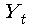와 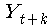의 관계를 나타내는 방법으로는 자기상관함수 ( ACF ) 와 부분자기상관함수 ( partial autocorrelation function :PACF ) 가 있다.

## 부분 상관관계의 의미

 **세 개의 변수 X, Y, Z 가 있을 때 Z 의 효과를 제거한 X와 Y 간의 부분상관관계**

**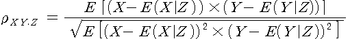** 

## 자기상관함수와 부분자기상관함수의 차이

1. 자기상관함수는 두 시계열확률변수 간의 상관관계만 보여주지만 부분자기상관함수는 두 시계열확률변수간에 다른 시점의 확률변수의 영향력은 통제하고 상관관계만 보여준다.

2. 자기상관함수는 자기시계열 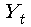와 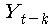 간의 상관관계만 나타내주고,

   부분자기상관함수는 t 와 t-k 사이의 시계열과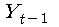와 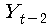.. 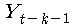 의 상호상관관계를 제거한후의와  간의 상관관계를 나타내준다.

 

## 부분 자기 상관 함수

 **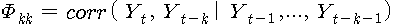**

ARIMA 모형에 의한 시계열분석에서 가장 중요한 함수이다.

 

## 표본부분자기상관함수 ( sample partial autocorrelation function : SPACF )

1. 표본에서 추정된 표본상관계수

2. 시계열 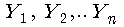에서 표본자료로부터 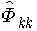 라고 표시