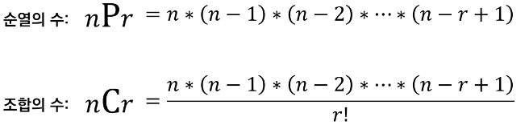

# 실전에서 유용한 표준 라이브러리

- 내장 함수 : 기본 입출력 함수 부터 정렬 함수까지 기본적인 함수들을 제공

```python
# sum
result = sum([1,2,3,4])

# min, max
min_result = min([1,2,3,4])
max_result = max([1,2,3,4])

# eval
result = eval('(3+5)*7')

# sorted
result = sorted([9,1,2,5,3], reverse = True)

# sorted with key
array = [('홍',35),('이',75),('아',50)]
result = sorted(array, key = labda x: x[1], reverse = True)
```


- itertools : 파이썬에서 반복되는 형태의 데이터를 처리하기 위한 유용한 기능을 제공
  - **특히 순열과 조합 라이브러리 중요** <코딩 테스트에서 자주 사용>
- 순열 : 서로 다른 n개에서 서로 다른 r개를 선택하여 일렬로 나열하는 것
  - {'a','b','c'}에서 세 개를 선택하여 나열하는 경우
  - == 'abc','acb','bac','bca','cab','cba'
- 조합 : 서로 다른 n개에서 순서에 상관없이 서로 다른 r개를 선택
  - 'ab', 'bc','ca'




```python
# 순열
from itertools import permutations

data = ['a','b','c']
result = list(permutations(data,3))
print(result)
```

```python
[('a','b','c'),('a','c','b'),('b','a','c'),('b','c','a'),('c','a','b'),('c','b','a')]
```

```python
# 조합
from itertools import combinations

data = ['a','b','c']
result = list(combinations(data,2))
print(result)
```

```pyton
[('a','b'),('a','c'),('b','c')]
```


```python
# 중복 순열
from itertools import product

data = ['a','b','c']
result = list(product(data,repeat = 2))
print(result)

# 중복 조합
from itertools import combinations_with_replacement

data = ['a','b','c']
result = list(combinations_with_replacement(data,2))
print(result)
```


- heapq : 힙 자료구조
  - 일반적으로 우선순위 큐 기능을 구현하기 위해 사용
- bisect :  이진 탐색 기능을 제공


- collections : deque, Counter 등의 유용한 자료구조를 포함

```python
# Counter 사용
# 등장 횟수를 세는 기능
# 리스트와 같은 반복 가능한 객체가 주어졌을 때 내부의 원소가 몇번씩 등장하는지 알려줌

from collections import Counter

counter = Counter(['a','a','b','b','g','b'])

print(counter('b'))
print(dict(counter))
```

```python
3
1
{'a':2,'b':3,'g':1}
```


- math : 필수적인 수학적 기능 제공
  - 팩토리얼, 제곱근, 최대공약수, 삼각함수 관련 함수부터 파이 같은 상수 포함

```python
# 최대공약수 gcd()

import math

# 최소 공배수 lcm()
def lcm(a,b):
    return a*b//math.gcd(a,b)
a = 21
b = 14

print(math.gcd(a,b))
print(lcm(a,b,))
```

```python
7
42
```

